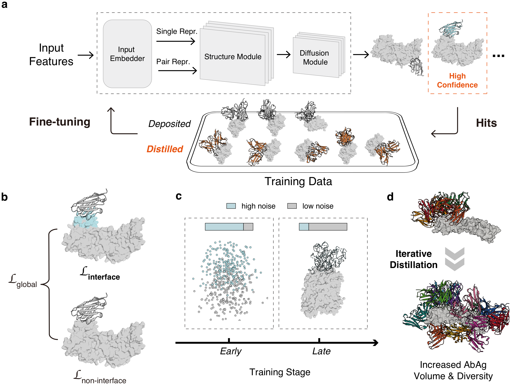
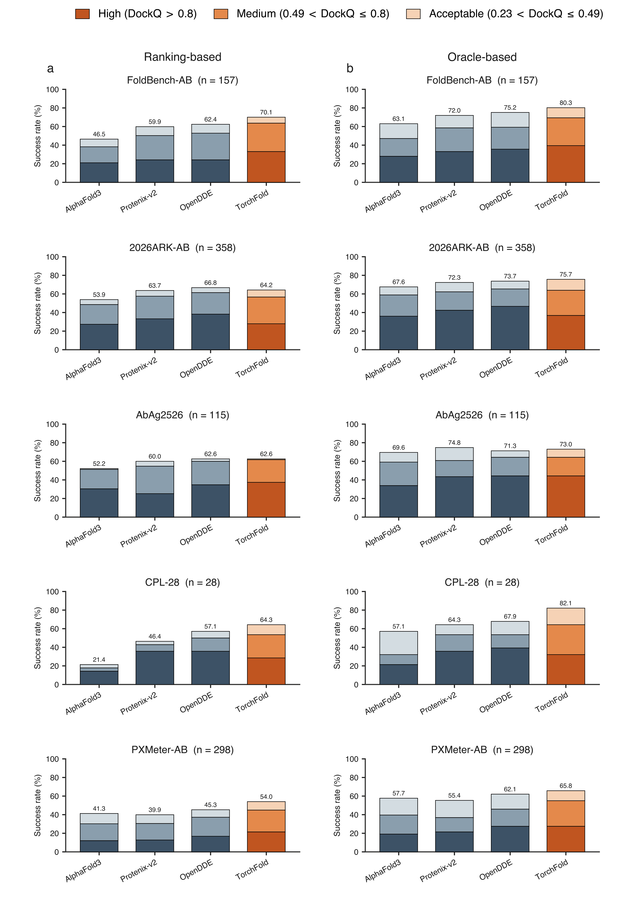
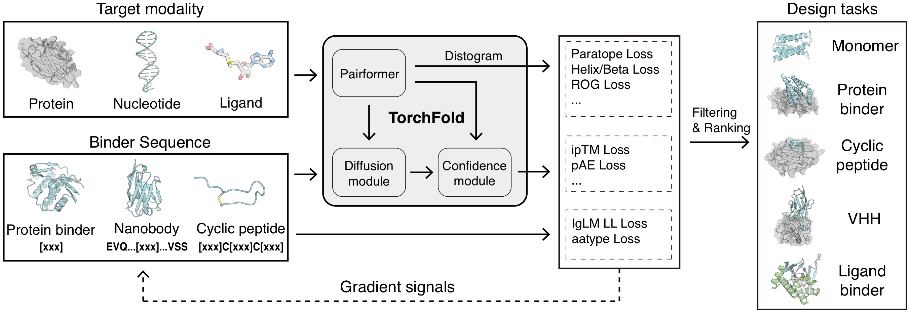

# TorchX

**GPU implementation** · Changping Laboratory

<div align="center">

[🌐 Project Page](https://torchx-cpl.github.io) · [📄 TorchFold Paper](https://torchx-cpl.github.io) · [📄 TorchCraft Paper](https://torchx-cpl.github.io)

</div>

TorchX is an open all-atom biomolecular stack with four modules:

- **TorchFold** — improving antibody–antigen structure prediction through large-scale distillation of sequence pairs
- **TorchScore** — a score-only adaptation of TorchFold for biomolecular structure evaluation
- **TorchCraft** — unified binder design by inverting an all-atom structure predictor
- **TorchFold Train** — training / fine-tuning

This repository is the **GPU** tree (`main`). Released under the MIT license.

[⚡ Web Server](https://torchfold.openi.org.cn/) — We provide a TorchFold web server so you can try inference quickly.

[🤗 Hugging Face](https://huggingface.co/datasets/TorchX-CPL/TorchFold) — TorchFold weights and the publicly available training data can be accessed on Hugging Face.

## 🧬 TorchFold overview

TorchFold keeps the AlphaFold 3 architecture and improves antibody–antigen prediction with an interface-specific loss, a high-noise diffusion schedule, and two-round distillation that expands unique Ab–Ag examples from 5.0k to 24.5k.

<p align="center">
  
</p>

---

## 📊 TorchFold Benchmark

We compare TorchFold with AlphaFold3, Protenix-v2 and OpenDDE; MSAs for every method, including OpenDDE, were generated with the official AF3 Jackhmmer search. On FoldBench-AB, TorchFold reaches 70.1% ranked success.

<p align="center">
  
</p>

---

## 🛠️ TorchCraft overview

TorchCraft inverts a frozen TorchFold to design binders by backpropagating confidence and interface losses onto sequence logits. Four minibinder and four VHH campaigns all yielded nanomolar binders from raw output, without post-hoc MPNN redesign.

<p align="center">
  
</p>

## 📁 Repository layout

Install **torchx first** for TorchFold, TorchCraft, and TorchScore — they all depend on it.

**TorchFold Train does not use the torchx environment.** Create a separate conda / venv and follow [`torchfold_train_gpu/README.md`](torchfold_train_gpu/README.md). Do not `pip install` it into the torchx env used for inference, scoring, or design.

| Directory | What it is |
|---|---|
| [`torchx_gpu/`](torchx_gpu/README.md) | Base environment, CCD chemical data, shared runtime |
| [`torchfold_gpu/`](torchfold_gpu/README.md) | Structure prediction / co-folding |
| [`torchcraft_gpu/`](torchcraft_gpu/README.md) | Binder design (monomer, minibinder, VHH, …) |
| [`torchscore_gpu/`](torchscore_gpu/README.md) | Score-only evaluation of complexes |
| [`torchfold_train_gpu/`](torchfold_train_gpu/README.md) | Training / fine-tuning; [`torchfold-prepare-training-assets`](torchfold_train_gpu/torchfold-prepare-training-assets/README.md) builds assets from CIF + JSON |

**Inference vs training eval.** Use [`torchfold_gpu/`](torchfold_gpu/README.md) for released / production inference. The infer scripts inside `torchfold_train_gpu/` (`scripts/infer/infer_af3.sh`, `predict_json.sh`) are only for training evaluation. Do not run both stacks for the same prediction job.

## 🌿 Other branches

GPU and NPU both live in [github.com/Mingchenchen/TorchX](https://github.com/Mingchenchen/TorchX).

| Branch | Hardware | Where |
|---|---|---|
| **`main` (this tree)** | NVIDIA GPU | current tree |
| **NPU** | Ascend NPU | [the NPU branch of this GitHub repo](https://github.com/Mingchenchen/TorchX/tree/TorchX-npu) · also [GitCode (NPU only)](https://gitcode.com/AI4Science/Mingchenchen) |

The two branches share the same scientific modules. GPU-only extra: optional [cuEquivariance](https://github.com/NVIDIA/cuEquivariance) triangle kernels (`cuequivariance-torch`). NPU-only extras: `mx_driving`, tcmalloc, and optional CANN Fusion_Attention. See each branch README for details.

## 🚀 Getting started

1. Create the conda environment and install **torchx** (this compiles C++ extensions and builds CCD data):

   ```bash
   cd torchx_gpu/torchx
   # follow torchx_gpu/README.md
   ```

2. Pick a module and follow its README. Edit path placeholders (`/path/to/...`) before running.

   | Task | Entry |
   |---|---|
   | Fold | [`torchfold_gpu/README.md`](torchfold_gpu/README.md) → edit `src/scripts/env.sh`, then `bash run.sh` |
   | Score | [`torchscore_gpu/README.md`](torchscore_gpu/README.md) → `TorchScore_pipeline.sh` |
   | Design | [`torchcraft_gpu/README.md`](torchcraft_gpu/README.md) → `task/monomer_unconditional/batch_submit.sh`, `task/vhh/vhh_design.sh`, `task/mini_binder/mini_binder_design.sh` |

3. Training is **independent**. Do **not** reuse the torchx environment:

   ```bash
   cd torchfold_train_gpu
   # create a new env, then follow torchfold_train_gpu/README.md
   # CIF + TorchFold JSON (with MSA) → training assets:
   #   torchfold_train_gpu/torchfold-prepare-training-assets/README.md
   ```

Optional GPU acceleration for TorchCraft: install `cuequivariance-torch` and `cuequivariance-ops-torch-cu12`, then set `TRIANGLE_MULTIPLICATIVE` / `TRIANGLE_ATTENTION` to `"cuequivariance"` in `torchcraft_gpu/task/config/base.yaml`. The default is `"torch"`.

## 💾 Checkpoints

TorchFold trained weights (`.pt`) and public TorchFold training data are released on Hugging Face (gated; request access on the dataset page):

[https://huggingface.co/datasets/TorchX-CPL/TorchFold](https://huggingface.co/datasets/TorchX-CPL/TorchFold)

```bash
hf download TorchX-CPL/TorchFold --repo-type dataset --local-dir ./TorchFold
```

To turn your own CIF files and TorchFold JSON (with MSA) into training assets, see [`torchfold_train_gpu/torchfold-prepare-training-assets/README.md`](torchfold_train_gpu/torchfold-prepare-training-assets/README.md).

For fold / score / design, set **exactly one** of the following:

- **`CHECKPOINT_PATH` / `checkpoint_path`**: TorchFold trained weights (`.pt`) from the Hugging Face dataset
- **`MODEL_DIR` / `model_dir`**: official AlphaFold 3 parameters directory (apply from DeepMind)

If both are set, the checkpoint takes priority. Comment out the unused one.

Set the path in:

- Fold: `torchfold_gpu/src/scripts/env.sh` (`CHECKPOINT_PATH` or `MODEL_DIR`)
- Score: `torchscore_gpu/src/pipeline_scripts/TorchScore_pipeline.sh` (`MODEL_DIR`; or `--checkpoint_path` as described in the TorchScore README)
- Design: `torchcraft_gpu/task/config/base.yaml` (`checkpoint_path` or `model_dir`)
- Train: see [`torchfold_train_gpu/README.md`](torchfold_train_gpu/README.md) (`TORCHFOLD_ROOT_DIR` for public training data, or assets from `torchfold-prepare-training-assets`)

## 📚 Citation

```bibtex
@misc{chen2026torchfold,
  title        = {TorchFold: Distillation of diverse antibody-antigen interfaces improves structure prediction},
  author       = {{TorchFold Team}},
  year         = {2026},
  note         = {Changping Laboratory},
  url          = {https://torchx-cpl.github.io}
}

@misc{chen2026torchcraft,
  title        = {TorchCraft: Hallucination-based all-atom protein design with TorchFold},
  author       = {{TorchCraft Team}},
  year         = {2026},
  note         = {Changping Laboratory},
  url          = {https://torchx-cpl.github.io}
}
```

## 📝 License

Released under the [MIT license](LICENSE). Correspondence: [mingchenchen@cpl.ac.cn](mailto:mingchenchen@cpl.ac.cn)
